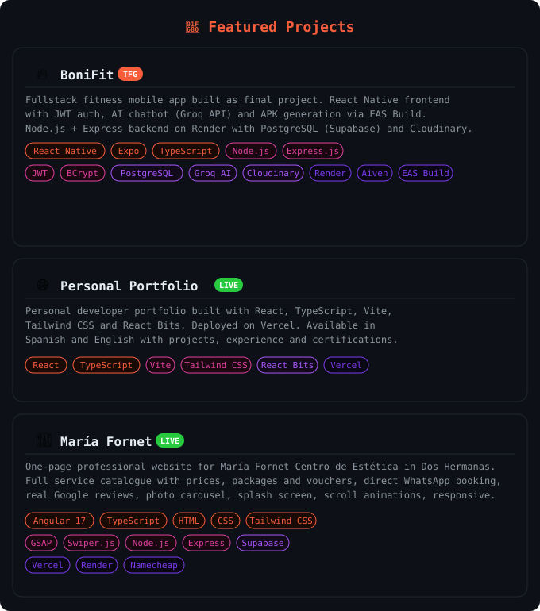

<!--BANNER-->

<!--ABOUT ME-->

<!--TECH STACK-->

  <h2>🔧 Tools I Build With</h2>
  

  

 

<!--GITHUB STATS-->

<h2>📊 GitHub Stats</h2>

<table>
  <tr>
    <td>
      
    </td>
    <td>
      
    </td>
  </tr>
</table>

<!--CONTACT-->

<h2>📬 Let's Connect</h2>

